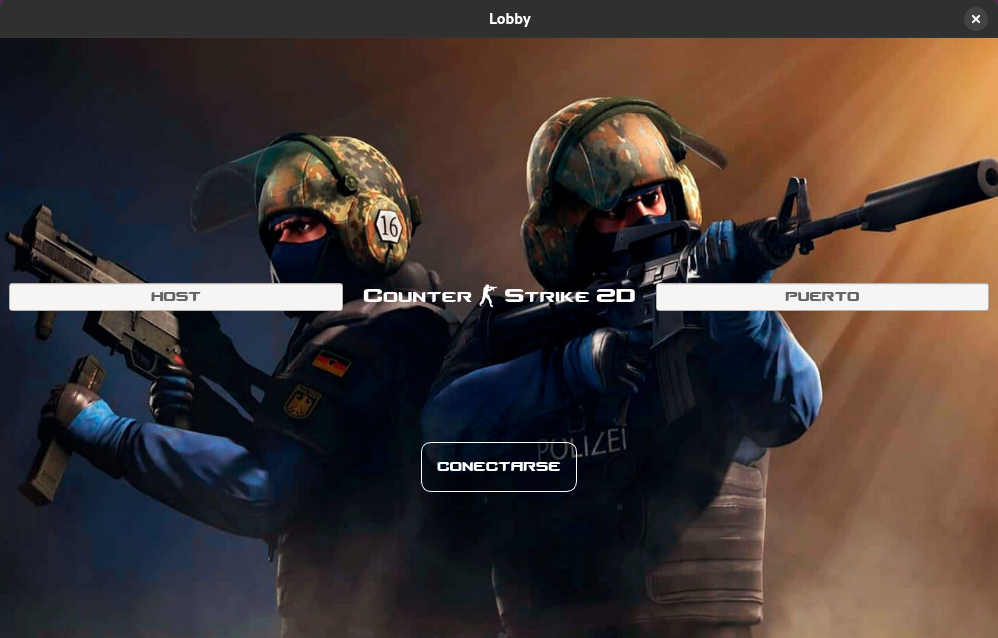
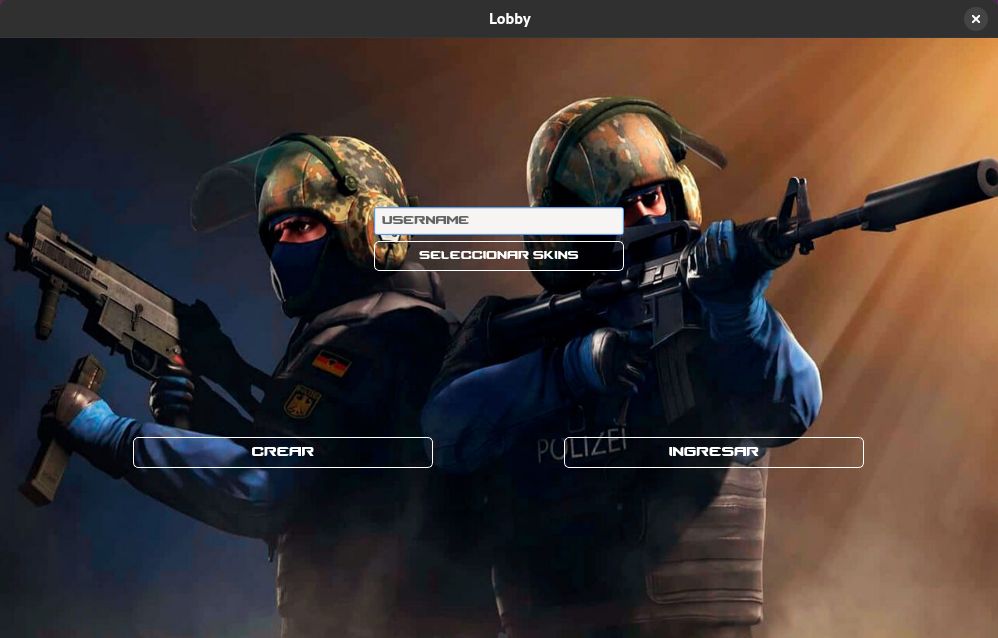
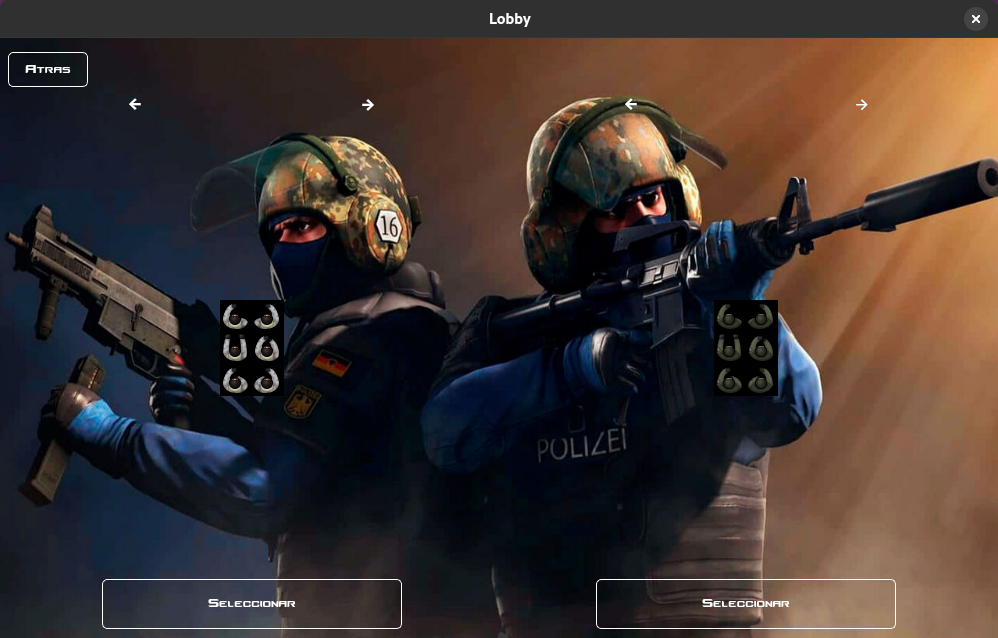
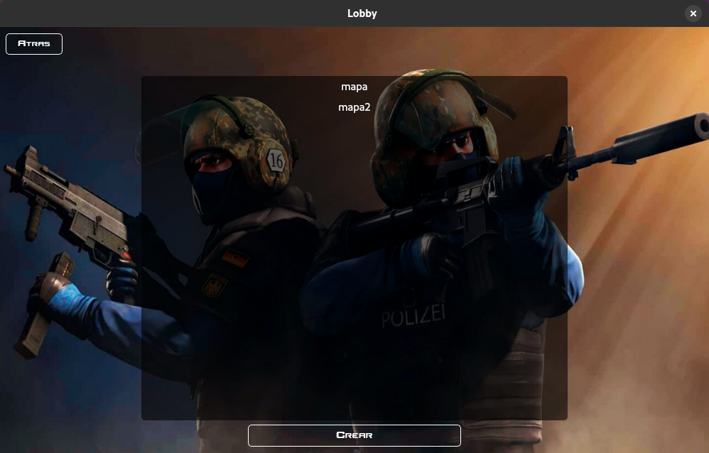
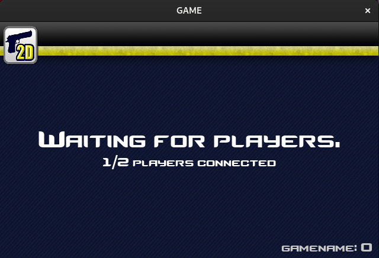
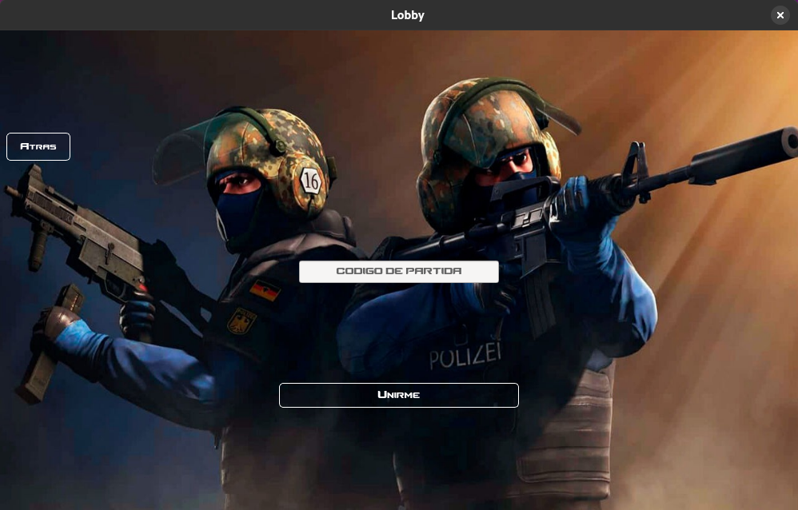
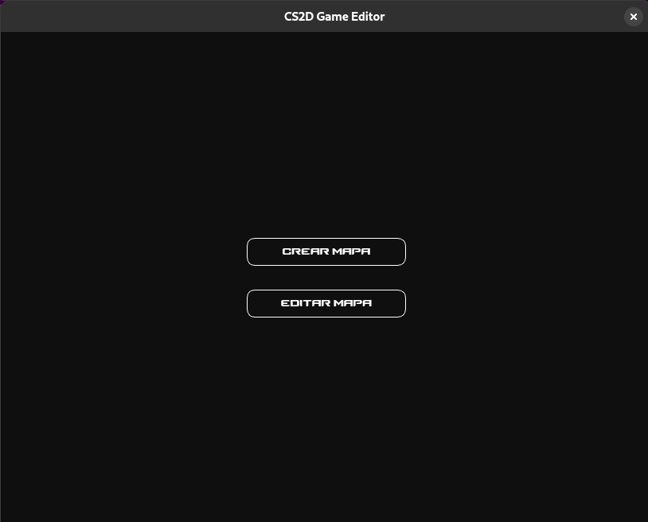
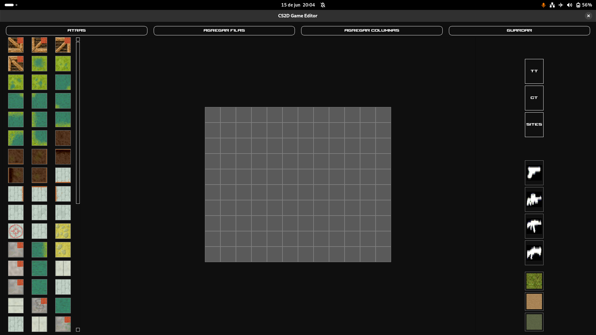
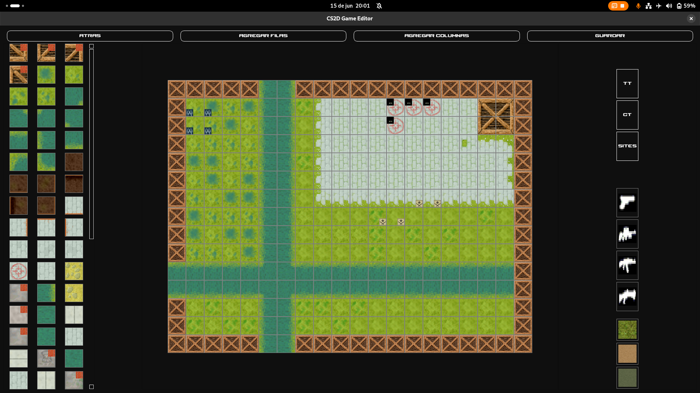

# CS2D Remake

[Página web](https://cs2d.vercel.app/)

## Instalación

Para utilizar el juego se debe utilizar un SO Ubuntu 24.04, y parado sobre la raíz del proyecto ejecutar una terminal y correr:

```
chmox +x installer.sh
./installer.sh
```

En caso de estar en Fedora >= 40 hacerlo de manera simétrica con

```
chmox +x fedora_installer.sh
./fedora_installer.sh
```

## Juego

Se debe ejecutar una terminal y correr:

```bash
cs2d-remake-server
```

Luego, a medida que se quieran agregar jugadores, tendrás que correr en otras ventanas de la terminal:

```bash
cs2d-remake-client
```

Una vez que se inicia la interfaz gráfica verás esto:



Allí deberás colocar `localhost` en el espacio donde dice **host** y en puerto colocar `8080`. En caso de ejecutar el servidor en otro puerto (es decir, con otro número como `cs2d-remake-server xxxx`), deberás usar ese número como puerto.

Una vez conectado al servidor verás la siguiente pantalla:



Acá tenés dos opciones:

- Crear una partida.
- Unirte a una partida.

Para cualquiera de estas dos opciones debés crearte un nombre de usuario. El servidor identifica a cada jugador con su nombre, por lo cual este debe ser único. Si ya existe, te aparecerá un mensaje indicándote que lo cambies.

Además, podés cambiar las skins con las que verás a ambos bandos, seleccionando **Seleccionar skins**. Allí verás:



Las skins a la izquierda son las **terrorists**, y las de la derecha las **counter-terrorist**.

Para cambiar la skin de los terrorists, usá las dos primeras flechas y confirmá con **Seleccionar**. Lo mismo para las counter-terrorist.

### Crear una partida



Seleccioná el mapa donde querés jugar y tocá el botón **Crear**. Verás una pantalla de carga donde aparece el nombre/código del juego y cuántos jugadores hay conectados.



### Unirse a una partida

Ingresá el nombre del juego al que te querés unir (el mismo que se muestra en la pantalla de carga):



---

## Reglas del juego

Una vez que todos los jugadores estén conectados, comenzará la partida, que constará de **10 rondas**. Ganará el equipo que haya ganado más rondas. No se termina anticipadamente (por ejemplo si un equipo ya lleva 6-0), siempre se juegan las 10 rondas.

### Las rondas se ganan si:

- Todo el equipo rival muere sin que esté plantada la bomba.
- Todo el equipo **counter-terrorist** muere **estando** plantada la bomba.
- Los **terrorists** plantan la bomba y esta explota.
- Los **counter-terrorist** desactivan la bomba antes de que explote.

Ambos equipos empiezan con dinero inicial, una **glock** como arma secundaria y un **cuchillo**. Al iniciar cada ronda, un **terrorista aleatorio** tendrá la bomba C4.

Habrá un período inicial de **compra**, donde los jugadores pueden gastar su dinero en:

- Arma primaria:
  - AK-47 (fusil de asalto)
  - M3 (escopeta)
  - AWP (rifle francotirador)
- Balas:
  - Para arma primaria
  - Para la glock

Si ya tenés un arma primaria y comprás otra, la anterior caerá al suelo como **drop**.

Si un jugador muere, su equipamiento (excepto el cuchillo) caerá cerca de su cuerpo como **drop**, y otro jugador podrá usarlo.

Después de la compra, inicia la **fase de ataque**, y se gana según las condiciones mencionadas.

Al finalizar una ronda, comienza una nueva, con marcador actualizado.

### Recompensas:

- Ganar una ronda: recompensa monetaria a todos los del equipo.
- Matar un enemigo: recompensa para el ejecutor.
- Matar a un compañero: **sin recompensa** (¡no lo hagas!).

Al finalizar la última ronda, se mostrarán las **estadísticas** (rondas ganadas, muertes, asesinatos). Luego, la interfaz se cerrará y te desconectará del servidor.

Para volver a jugar, simplemente ejecutá el programa de nuevo; podrás usar tu nombre (ya que al desconectarte, se borra tu usuario del registro).

---

## Editor de niveles

El juego incluye un editor de mapas. Para usarlo, ejecutá desde el directorio raíz:

```bash
cs2d-remake-editor
```

Verás el siguiente menú:



### Crear mapa



Se creará una grilla 10x10 en la que podrás indicar por celda:

- Tipo de elemento:
  - Colisionable (con marca naranja).
  - No colisionable.
- Si es spawn CT.
- Si es spawn TT.
- Si es un site.
- Si hay un arma dropeada.

Además, podrás elegir un **fondo** para el mapa.

#### Controles:

- **Doble click izquierdo**: agregar un bloque/spawn/site/arma en una celda.
- **Click izquierdo + drag**: agregar en un área.
- **Doble click derecho**: borrar de una celda.
- **Click derecho + drag**: borrar en un área.

Notas:

1. Para fondos, solo hacé click.
2. Tenés que **seleccionar** el bloque/spawn/site/arma de los paneles laterales antes de dibujar o borrar.

Los agregados se visualizarán como íconos encima del bloque, igual que los colisionables.

### Editar mapa



Es igual a la creación, pero sobre un mapa ya existente (uno del juego o uno que hayas hecho).

Guardá tus mapas en la carpeta:

```bash
maps
```

Esto es necesario para que el mapa aparezca como opción al crear una partida.

El editor requiere:

- Al menos **2 spawns** (uno CT, uno TT).
- Al menos **1 celda** como site.

Esto permite también jugar partidas al estilo **deathmatch**.

### Acerca del trabajo

Este fue nuestro trabajo práctico grupal para la materia Taller de Programación I de la Facultad de Ingeniería Universidad de Buenos Aires, 1C2025.

#### Grupo 5

Integrantes: 

- Fernandez, Facundo 
- Molina, Taiel
- Rebollo, Matías
- Rocha Diaz, Tomás

Agradecemos por la ayuda y buena onda a nuestro corrector designado Mateo Capón :)
